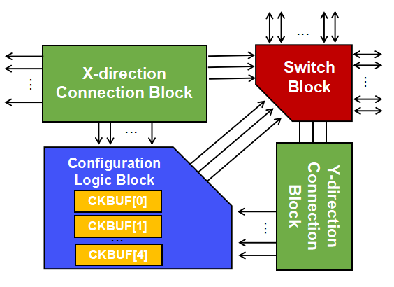
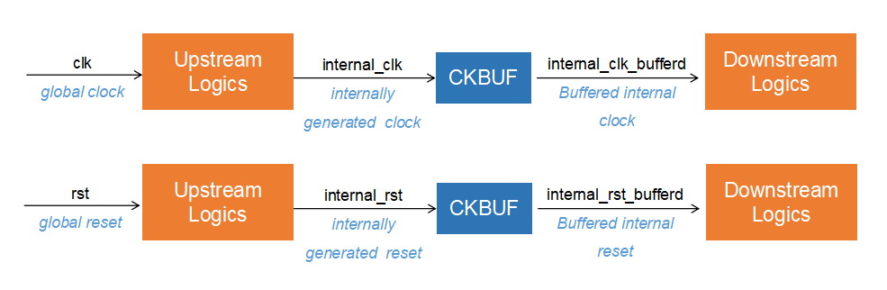

.. _file_format_ckbuf_cell_map_file:

Ckbuf Cell Map File (.xml)
==========================

This file is generated by the Yosys plugin. It specifies information about the ckbuf, including its input net, ckbuf name, and type (either reset or clock).

In eFPGA hardware, special buffers are placed near the entry points of the global network, as illustrated in :numref:`fig_ckbuf_concepts`. These buffers are used to constrain the mapping of internally generated global signals. The ``ckbuf`` insertion process is shown in :numref:`fig_ckbuf_process`. In this process, upstream logic generates ``internal_clk`` and ``internal_rst`` (internal clock or reset signals) from the global ``clk`` or ``rst`` inputs. These internally generated signals are then buffered with ``ckbuf``, producing ``internal_clk_buffered`` and ``internal_rst_buffered``, which are used as clock or reset sources for downstream logic. When an internally generated clock is mapped to a specific clock input, such as ``clk``, the corresponding clock buffer in the tile must be selected (e.g., ``CKBUF[0]`` in :numref:`fig_ckbuf_concepts`). Once a clock buffer is assigned, the associated global network port cannot be mapped to any other global signal.

.. _fig_ckbuf_concepts:

   CKBUF in the tiles near entry points of dedicated network

.. _fig_ckbuf_process:

   eFPGA ckbuf addition

An example file is shown as follows.

.. literalinclude:: clk_cell_map.xml
   :language: xml

Ckbuf Cell
^^^^^^^^^^

Each ckbuf cell is defined using a key ``ckbuf``.

.. option:: <ckbuf input_net="<string>>" cell="<string>" type="<string>"/>

  - ``input_net`` specifies the net name of an internally generated clock or reset signal. The signal will be buffered to drive downstream logic.

  - ``cell`` specifies the name of the ckbuf cell which is auto-assigned by Yosys plugin.

  - ``type`` specifies the type of global signal buffered by the ckbuf cell (either reset or clock).

