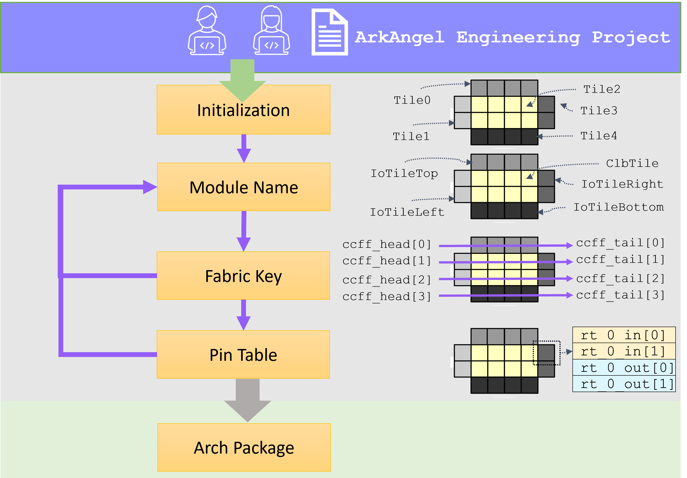

.. _tutorial_arch_flow:

Arch Development
----------------

An architecture development flow consists a number of steps to consolidate all the architecture-level details:

- Initialization
- Module names
- Fabric key
- Pin table

During each step, users can access and check any existing aspects and customize their choices based on default settings, as depicted in :numref:`fig_aaee_arch_dev_flow`

.. _fig_aaee_arch_dev_flow:



   Architecture development flow

Initialization
``````````````

.. note:: The runtime of initialization may take a few minutes to finish, as it has to cache all the corners.

This step typically perform a thorough initialization on a selected architecture by caching frequently used data.
Once this step is accomplished, the number of tiles and their initial names are available to user.

.. code-block::

  # Create a project. See details in dedicated tutorial
  # Perform initialization
  create_arch
  # Once initialization is complete, use the following command to check the initial nameing of tiles
  report_reference_module_names
  # You may also use the following command to check the raw file
  show_arch --type init_module_names

You may see a summary of reference module names to help you customization.

.. code-block::

  Default Name	Type             	Count	
  tile_14_    	EMPTY            	1    	
  tile_7_     	io_bottomL_bottom	15   	
  tile_11_    	io_bottomL_bottom	1    	
  tile_0_     	EMPTY            	1    	
  tile_4_     	io_leftL_left    	1    	
  tile_2_     	io_leftL_left    	1    	
  tile_3_     	io_leftL_left    	1    	
  tile_1_     	io_leftL_left    	4    	
  tile_5_     	io_leftL_left    	1    	
  tile_15_    	io_rightL_right  	7    	
  tile_16_    	io_rightL_right  	1    	
  tile_8_     	clb              	105  	
  tile_12_    	clb              	7    	
  tile_13_    	clb              	1    	
  tile_9_     	clb              	15   	
  tile_6_     	EMPTY            	1    	
  tile_10_    	io_topL_top      	16 

When users customize the names by crafting the module name file (See details in :ref:`file_formats_module_naming_file`), the default name corresponds to the content of syntax ``default``. Users just need to set their final name through the syntax ``given``.
Take the example below, each tile can have a custom name by crafting a file. If you wish to keep the default name for a tile, e.g., ``tile_1_``, you can remove the associated line.

.. code-block:: xml

  <module_names>
    <module_name default="tile_0_" given="left_bottom_tile"/>
    <module_name default="tile_1_" given="left_tile_main"/>
    <module_name default="tile_2_" given="left_tile_clock_below"/>
    <module_name default="tile_3_" given="left_tile_clock_out"/>
    <module_name default="tile_4_" given="left_tile_clock_above"/>
    <module_name default="tile_5_" given="left_tile_sub"/>
    <module_name default="tile_6_" given="top_left_tile"/>
    <module_name default="tile_7_" given="bottom_tile"/>
    <module_name default="tile_8_" given="tile_main"/>
    <module_name default="tile_9_" given="tile_sub"/>
    <module_name default="tile_10_" given="top_tile"/>
    <module_name default="tile_11_" given="bottom_tile_right_edge"/>
    <module_name default="tile_12_" given="tile_right_edge_main"/>
    <module_name default="tile_13_" given="tile_right_edge_sub"/>
    <module_name default="tile_14_" given="bottom_right_tile"/>
    <module_name default="tile_15_" given="right_tile_main"/>
    <module_name default="tile_16_" given="right_tile_sub"/>
  </module_names>

Module Names
````````````

This step allows user to provide customization on the names of tiles, which will impact the downstream flows.
Once this step is accomplished, the initial organization of configuration protocol (fabric key) is available to users.

.. code-block::

  # You may specify the path to your module_names.xml 
  set_arch --type module_names --file ../config/craft_files/module_names.xml
  # Check the resulting module names
  show_arch --type module_names
  # Use the following command to check your reference fabric key
  show_arch --type reference_fabric_key

.. note:: You may use the built-in module naming rule if you do not wish to perform customization yourself.

.. code-block::

  # Use the default than a hand-crafted file 
  set_arch --type module_names 
  # Check the resulting module names
  show_arch --type module_names
  # Use the following command to check your reference fabric key
  show_arch --type reference_fabric_key

Fabric Key
``````````

This step allows user to provide customization on how the tiles are connected in the context of configuration protocol.
Once this step is accomplished, the initial pin table of the configuration protocol is available to users

.. note:: The command ``report_module_names`` is ready to use after the initial pin table is commited. 

.. code-block::
 
  # Commit your fabric key file. You may specify the path to your fabric key file 
  set_arch --type crafted_fabric_key --file ../config/craft_files/crafted_fabric_key.xml
  # Check the final fabric key file
  show_arch --type fabric_key
  # Validate your final module names
  report_module_names

When craft your fabric key file (if you do not prefer the default one), you just need to fill the syntax ``alias`` and ``id`` (See details in :ref:`file_formats_fabric_key`).
For example,

.. code-block::

  <fabric_key>
    <module name="fpga_top">
      <region id="0">
        <key id="0" alias="tile_1__4_"/>
        <key id="1" alias="tile_1__3_"/>
        <key id="2" alias="tile_1__2_"/>
        <key id="3" alias="tile_1__1_"/>
        <key id="4" alias="tile_1__0_"/>
        <key id="5" alias="tile_0__0_"/>
        <key id="6" alias="tile_0__1_"/>
        <key id="7" alias="tile_0__2_"/>
        <key id="8" alias="tile_0__3_"/>
        <key id="9" alias="tile_0__4_"/>
      </region>
    </module>
  </fabric_key>

ArkAngel can auto-fill the rest of the data required (when you check the result through command ``show_arch``)

.. note:: You may use the built-in fabric key if you do not wish to perform customization yourself.

.. code-block::

  # use the default
  set_arch --type crafted_fabric_key
  # Check the final fabric key file
  show_arch --type fabric_key
  # Validate your final module names
  report_module_names

You may see a summary of module names to validate you customization.

.. code-block::

  Final Name            	Default Name	Type             	Count	
  bottom_right_tile     	tile_14_    	EMPTY            	1    	
  bottom_tile           	tile_7_     	io_bottomL_bottom	15   	
  bottom_tile_right_edge	tile_11_    	io_bottomL_bottom	1    	
  left_bottom_tile      	tile_0_     	EMPTY            	1    	
  left_tile_clock_above 	tile_4_     	io_leftL_left    	1    	
  left_tile_clock_below 	tile_2_     	io_leftL_left    	1    	
  left_tile_clock_out   	tile_3_     	io_leftL_left    	1    	
  left_tile_main        	tile_1_     	io_leftL_left    	4    	
  left_tile_sub         	tile_5_     	io_leftL_left    	1    	
  right_tile_main       	tile_15_    	io_rightL_right  	7    	
  right_tile_sub        	tile_16_    	io_rightL_right  	1    	
  tile_main             	tile_8_     	clb              	105  	
  tile_right_edge_main  	tile_12_    	clb              	7    	
  tile_right_edge_sub   	tile_13_    	clb              	1    	
  tile_sub              	tile_9_     	clb              	15   	
  top_left_tile         	tile_6_     	EMPTY            	1    	
  top_tile              	tile_10_    	io_topL_top      	16 


Pin Table
`````````

This step allows user to customize on the I/O names by providing I/O naming rules.
Once this step is accomplished, the architecture package is ready for downstream development.

Note that the I/O naming rules are applicable to two fabrics, one is ``dp`` which is designed for design planning and the other one ``ultimate`` is the actual fabric.  

.. code-block::

  ### Pin table generation for dp fabric
  set_arch --fabric dp --type io_pin_table_naming_rules --file ../config/craft_files/dp_pin_table_naming_rules.xml
  ### Pin table generation for ultimate fabric
  set_arch --fabric ultimate --type io_pin_table_naming_rules --file ../config/craft_files/ultimate_pin_table_naming_rules.xml

.. note:: You may use the built-in naming rules if you do not wish to perform customization yourself.

.. code-block::

  ### Pin table generation for dp fabric, use default 
  set_arch --fabric dp --type io_pin_table_naming_rules
  ### Pin table generation for ultimate fabric, use default
  set_arch --fabric ultimate --type io_pin_table_naming_rules

Take the example of the following naming rules, TOP side is defined on the coordinates of tiles ranges from (1, 7) to (6, 7). As a result, the I/O indexing on the top side will start from ``tile_1__7_`` to ``tile_6__7_``. For example, the first I/O pin in ``tile_1__7_`` will be named as ``TOP_0_IN[0]``.

.. code-block::

  <pin_table_naming_rules>
    <side_rule side="TOP" startx="1" endx="6" starty="7" endy="7"/>
    <side_rule side="RIGHT" startx="7" endx="7" starty="1" endy="6"/>
    <side_rule side="BOTTOM" startx="1" endx="6" starty="0" endy="0"/>
    <side_rule side="LEFT" startx="0" endx="0" starty="1" endy="6"/>
  </pin_table_naming_rules>
