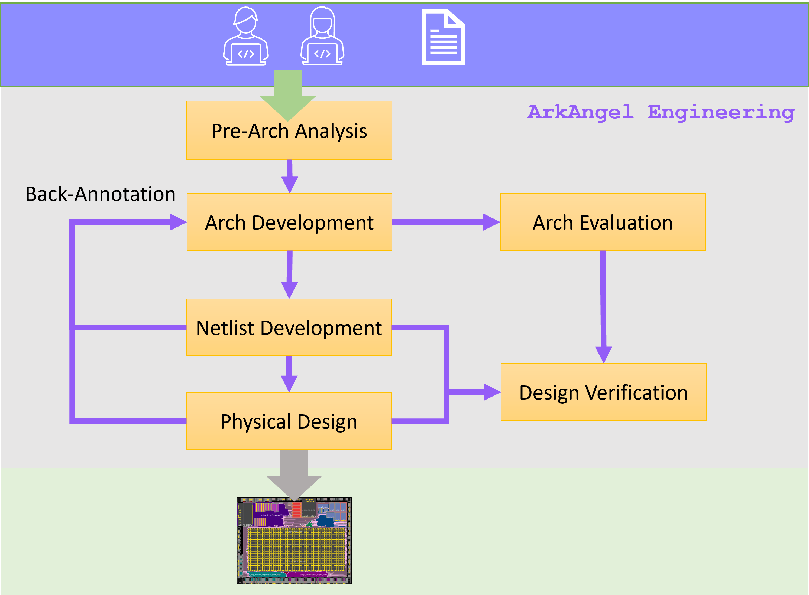

.. _tutorial_tapeout_flow:

Tapeout Flow
------------

As shown in :numref:`fig_aaee_hardip_flow`,  ArkAngel provides a complete design flow to develop an eFPGA IP, starting from architecture exploration to layout generation.
In addition to the final layout, the design flow covers all the aspects releated to the eFPGA IP, e.g., benchmarking, design verification, QoR back-annotation.
To formalize the process, the tapeout flow consists of a number of steps:

- Pre-architecture Analysis
- Architecture Development
- Netlist Development
- Design Verification
- Physical Design

Each steps may contain a number of substeps, through which user can update intermediate results to achieve their design targets.
This tutorial focuses on the principles of the steps and their relationship in the tapeout flow, while details in each step are covered in other tutorials.

.. _fig_aaee_hardip_flow:



   Tapeout flow

Pre-Arch Analysis
`````````````````

The pre-architecture analysis aims to assist users to select a proper eFPGA architecture to start with, through formalized method and benchmarking data.
The pre-arch analysis only requires users applications in HDL format. 

Through pre-arch analysis, users can identify

- the best LUT sizes for their eFPGA architecture in terms of resource utilization
- the resource requirements on LUTs, FFs, DSPs *etc.* based on their applications

The analyses help users to narrow down their selection on eFPGA architectures and then pick an eFPGA family to start with.

Arch Development
````````````````

When a specific eFPGA architecture is selected, users can finalize the architecture-level details by going through the architecture development step.
During the process, users can learn and customize (or use the default settings provided)

- The number of unique tiles in the eFPGA, and their names
- The organization of configuration protocol, such as number of clocks, configuration time *etc.*
- The pin table of the eFPGA, including names, directionality and location of I/Os

By the end of the step, a data pack of the eFPGA architecture will be produced, based on which the downstream steps can proceed.

Once this step is accomplished, the following details of architecture will be freezed:

- Resource capacity
- Array size
- I/O count, types and location
- Tile names
- Configuration protocol organization

Arch Evaluation
```````````````

Once the architecture development is accomplished, user can run evaluation to estimate the QoR of their applications.
During the process, QoR reports will be generated to provide

- Resource utilization
- Fmax at different corners

Throughout the process, users can identify 

- if eFPGA architecture can accomodate all the required applications
- if eFPGA performance is sufficient

Note that architecture evaluation can be run after other steps to provide different levels of accurary.

- After architecture development, this is a rough estimation on resource ultilization and Fmax. If resource limitation is seen, it is hard stop. Otherwise, the Fmax can be significantly improved (more than 2 times in some cases) during the netlist development and physical design. Recommend to re-run after the steps are accomplished.
- After netlist development, this is a close-form estimation on resource utilization, Fmax and power estimation.
- After physical design, this is an accurate analysis on resource utilization, Fmax and power estimation.

Note that this step is required before running any design verification.

Netlist Development
```````````````````

After architecture development, users can develop and analyze the fabric netlists of the eFPGA, before starting physical design.
During the process, users can 

- generate fabric netlists of the eFPGA
- optimize the netlists through synthesis with customized (or default) strategies
- analyze the silicon area, segemental timing paths and power consumption of the eFPGA at a whole or breakdown
- back-annotate QoR to architecture, after which architecture evaluation can be more accurate

Physical Design
```````````````

Underconstruction

Design Verification
```````````````````

After netlist development and architecture evaluation, users can run design verification on rtl-level and gate-level netlists.
After physical design, users can run design verification on post-layout netlists.

This step is to ensure that before tapeout if all the required applications can be functional and meet performance requirements.
